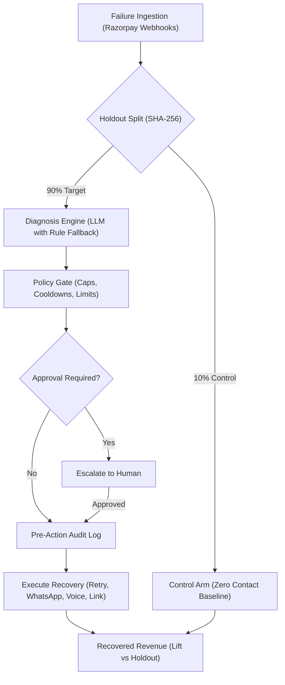

# FORTX - Flow Orchestration & Revenue Trust eXecution

> **Razorpay AI Buildathon - Track 03: AI Revenue Recovery Agent**  
> **Live Application:** [https://fortx.adixb.me](https://fortx.adixb.me)  
> **Video Walkthrough:** [https://youtu.be/ndwqjQJH8Hs](https://youtu.be/ndwqjQJH8Hs)

<p align="center">
  <a href="https://fortx.adixb.me/">
    
  </a>
  <a href="https://youtu.be/ndwqjQJH8Hs">
    
  </a>
</p>

<p align="center">
  <a href="#getting-started">Getting Started</a> &bull;
  <a href="#how-it-works">How it Works</a> &bull;
  <a href="#what-it-does">What it Does</a> &bull;
  <a href="#the-dashboard">The Dashboard</a> &bull;
  <a href="#setting-up-integrations">Integrations</a> &bull;
  <a href="webhook-relay/README.md">Webhook Relay</a> &bull;
  <a href="docs/ARCHITECTURE.md">Architecture</a>
</p>

<p align="center">
  <b>An agentic recovery system that diagnoses failed payments and executes policy-bounded actions to recover lost revenue.</b>
</p>


## How it works

- **Webhook Ingestion** - Ingests payment failures, abandoned checkouts, mandate halts, and overdue invoices in real time.
- **AI Diagnosis & Rule Fallback** - Identifies root cause and formulates recovery strategy via LLM, with deterministic rule fallback.
- **Customer Profiles** - Weighs each customer's own payment history (recovery rate, repeat failures, preferred rail, risk tier) so an identical error code on a customer who reliably pays is retried, while one against a thin history escalates instead of retrying into another decline.
- **Policy Enforcement** - Validates contact caps, cooldowns, discount limits, and routes high-value cases to human approval.
- **Pre-Action Audit Log** - Immutably logs all decision inputs and state transitions prior to executing any recovery action.
- **Cached Aggregate Reads** - A Redis read-through cache serves repeated analytics and pipeline reads instead of re-aggregating Postgres on every request.
- **Diagnosis Caching** - Caches each diagnosis by failure signature (error code, rail, amount band, NPCI code) rather than by payment, so identical failures reuse one result. **On the 1200-event benchmark this served 1036 of 1080 diagnoses from cache: a 95.9% hit rate that turned 1080 model calls into 44 and 2.5M tokens into 103K.** Recovering a failed payment has to cost less than the payment is worth, so inference cost per case is a product constraint. Priced at Claude Sonnet 5's live OpenRouter rate, that is **$0.00059 per case instead of $0.0145, a 24x reduction** - about $59 a month rather than $1,447 at 100,000 failures.
- **Recovery Propensity Model** - Learns from completed cases which failures are worth pursuing, using a three-model ensemble trained on the merchant's own data. It ranks and forecasts; it never authorizes an action, and the policy gate applies regardless of its score.
- **Safe Holdout Control** - Sets aside a deterministic baseline (default 10%, configurable from 0 to 50%) with zero outreach to mathematically verify incremental lift over organic recovery without disrupting normal customer payments.

<details>
<summary><b>View Architecture Flowchart</b></summary>



</details>

<details>
<summary><b>View Deployment Topology (current single-server setup)</b></summary>

<p align="center">
  
</p>

The current single-server deployment: which process runs where, and what each is
allowed to talk to. The API and worker are systemd units bound to `127.0.0.1`, so
nginx is the only route in.

The process boundaries are what would carry over to an orchestrated setup: the API and
worker are already separate units, and job leasing uses
`SELECT ... FOR UPDATE SKIP LOCKED`, so competing replicas claim different jobs rather
than blocking or double-running one. Postgres and Redis would become managed services
rather than compose containers.

Three things are process-local today and would need moving before running replicas: the
login throttle counter, the in-process diagnosis LRU, and the loaded propensity model.
`APP_SESSION_SECRET` must also be a fixed value, or two API replicas mint session
tokens the other rejects.

Full detail in [docs/ARCHITECTURE.md](docs/ARCHITECTURE.md), or open
[docs/architecture-diagram.html](docs/architecture-diagram.html) for the annotated
version.

</details>


## Getting started

### Prerequisites

- Python 3.13
- uv
- Node 22
- pnpm 11, through corepack
- Docker, for PostgreSQL and Redis
- An AI provider key is optional; without one it uses the rule-based fallback. Supported providers: OpenRouter, Anthropic, OpenAI, and Groq

### Setup

1. Make sure you have the prerequisites above installed.

2. Clone the repo and enter it:

```bash
git clone https://github.com/adityabavadekar/buildathon.git
cd buildathon
```

3. Copy the example environment file:

```bash
cp backend/.env.example backend/.env
```

4. Install dependencies and start Postgres and Redis:

```bash
make setup
```

5. Start the entire development stack:

```bash
make dev
```

`make dev` runs the backend (`:8000`), the frontend (`:5173`), and the recovery worker daemon all together.

To see all other available targets (such as running services individually or running tests):

```bash
make help
```

### Running in production

`make dev` is a reload-on-change development server. For a deployment, use the
container stack, which adds the backend, worker, and frontend to Postgres and
Redis:

```bash
cp .env.prod.example .env    # then fill it in
make prod-up                 # validates .env, builds, waits for health
make prod-ps                 # service status and health
make prod-logs               # follow every service
make prod-down               # stop, keeping the data volume
```

`make prod-up` refuses to start on a misconfigured `.env` rather than booting
something unsafe: it rejects the placeholder values and fails if
`APP_OPERATOR_PASSWORD` is empty, since an empty password disables the login gate.
`POSTGRES_PASSWORD` and `APP_SESSION_SECRET` are also required, and the session
secret must be fixed rather than regenerated per boot, or every restart logs
everyone out.

To run the API behind your own nginx instead, see
[docs/ARCHITECTURE.md](docs/ARCHITECTURE.md) for the host-process topology, the
TLS and SSE proxy requirements, and what changes between local and deployed
configuration.


## What it does

- Catches failures across payments, checkout, subscriptions, and invoices
- Uses an LLM to diagnose the failure and pick a strategy, with a rule-based
  fallback when no AI provider is configured
- Takes bounded action: smart retries, payment links, Smart Collect virtual
  accounts, WhatsApp/SMS/voice messages, or chasing a B2B invoice
- Places outbound Hinglish voice calls, using Sarvam AI for the speech
- Enforces limits before anything runs: contact caps, cooldowns, discount
  caps, opt-outs, and a value threshold requiring human approval
- Handles the full set of Razorpay webhooks: payments, refunds, disputes,
  subscriptions, payment links, invoices, and Smart Collect
- Keeps a plain-language record of every decision made and why
- Holds back a deterministic control group (default 10%, can be set to 0% to disable)
  to measure true incremental lift over organic recovery without disrupting normal
  customer payments
- Serves repeated analytics and pipeline reads from a Redis cache, so a polling
  dashboard does not re-aggregate Postgres on every request
- **Caches each diagnosis by failure signature, cutting the 1200-event benchmark
  from 1080 model calls to 44 and 2.5M tokens to 103K - a 24x lower inference
  cost per recovered case**; a hit reuses the category and strategy but drops the
  cached message text, since the key bands amounts
- Trains a recovery-propensity ensemble on completed cases to predict which
  failures will recover, how much of the value returns, and how long it takes
- Includes a benchmark tool that replays a fixed dataset and reports lift
  over doing nothing
- Lets a merchant edit the rules, choose an AI provider, and connect
  Razorpay via OAuth or an API key pair


## The dashboard

- **Overview / Analytics** - At-risk revenue, recovered revenue, and lift over the holdout group
- **Transactions / Awaiting Approval** - The case list, customer timeline, and human sign-off queue
- **Audit Log** - Plain-language history of every decision with full input transparency
- **AI Agent Telemetry** - Model, tokens, cost, and latency in real time
- **Data Pipeline / System Status** (dev) - Queue depth and worker health
- **Merchant Policies / Integrations** - Safety limits, cooldowns, and Razorpay connection

### Case Investigation & Transaction Audit Trail

| Case Diagnosis & Strategy Formulation | Transaction Decision Audit Trail |
| :---: | :---: |
|  |  |


## Setting up integrations

These are optional; without them the matching feature runs in simulation mode.

- **Razorpay** - Obtain API keys from the [Razorpay dashboard](https://dashboard.razorpay.com/) or configure a [Technology Partner OAuth](https://razorpay.com/docs/partners/technology-partners/onboard-businesses/integrate-oauth/) application, and populate the `RAZORPAY_*` variables.

  Then point a Razorpay webhook at the ingestion endpoint, or no failures ever
  reach the agent:

  ```
  POST https://<your-host>/api/webhooks/razorpay
  ```

  Set the same secret in the Razorpay dashboard and in `RAZORPAY_WEBHOOK_SECRET`.
  Every request is verified by HMAC-SHA256 against it before the body is parsed,
  and a bad signature is rejected with `401`. **With no secret configured
  anywhere, verification is skipped entirely and unsigned webhooks are accepted -
  set it before pointing a live account at this endpoint.**

  Subscribe to the events the recovery loop reads: `payment.failed`,
  `payment.captured`, `order.paid`, `subscription.halted`, `subscription.charged`,
  `subscription.cancelled`, `subscription.completed`, `invoice.paid`,
  `invoice.partially_paid`, `invoice.expired`, the `refund.*` events, and the
  `payment.dispute.*` events.

  The running dashboard shows its own ingress URL and whether the secret is
  configured under Settings, Integrations. Razorpay allows one URL per
  subscription, so for local development use
  [`webhook-relay/`](webhook-relay/README.md) to fan a single public tunnel out
  to several listeners.

  To verify ingestion without waiting for a real failure, sign a payload with the
  same secret and post it. Save this as `event.json`:

  ```json
  {
    "event": "payment.failed",
    "payload": {
      "payment": {
        "entity": {
          "id": "pay_TESTDOC00001",
          "amount": 249900,
          "currency": "INR",
          "method": "upi_autopay",
          "email": "customer@example.com",
          "contact": "+919000000000",
          "error_code": "BAD_REQUEST_ERROR",
          "error_description": "Your account does not have enough balance",
          "error_source": "bank",
          "error_step": "authorization",
          "error_reason": "insufficient_funds",
          "acquirer_data": { "error_code": "AP15" },
          "notes": { "user_id": "cust_9001", "recovery_campaign": "diwali_retry" }
        }
      }
    }
  }
  ```

  Then sign the exact bytes and send them:

  ```bash
  SECRET='<your RAZORPAY_WEBHOOK_SECRET>'
  SIG=$(openssl dgst -sha256 -hmac "$SECRET" -hex < event.json | awk '{print $NF}')

  curl -X POST https://<your-host>/api/webhooks/razorpay \
    -H 'Content-Type: application/json' \
    -H "X-Razorpay-Signature: $SIG" \
    --data-binary @event.json
  ```

  `--data-binary` matters: the signature covers the exact bytes, and curl's `-d`
  strips newlines, which changes the digest and returns `401`.

  A successful call returns `202` with the case it opened:

  ```json
  {"status":"queued","event":"payment.failed","case_id":"case_wh_9105809c","action_taken":"QUEUED"}
  ```

  That `AP15` acquirer code diagnoses as `LIQUIDITY_CONSTRAINT`. Fetch
  `GET /api/cases/<case_id>` to see the assigned arm, the chosen intervention, and
  the audit trail.

  To close the loop, send the recovery event for the same `id`. It matches on
  payment id, so it resolves the case the failure opened:

  ```json
  {
    "event": "payment.captured",
    "payload": {
      "payment": {
        "entity": { "id": "pay_TESTDOC00001", "amount": 249900, "currency": "INR" }
      }
    }
  }
  ```

  Signed and sent the same way, that returns `200`:

  ```json
  {"status":"processed","event":"payment.captured","case_id":"case_wh_9105809c","action_taken":"RECOVERED"}
  ```

  The case moves to `RECOVERED` and the amount lands in the recovered totals on
  `GET /api/analytics`. A `payment.captured` for an unknown payment returns
  `"action_taken":"NOOP"` rather than inventing a case.

  Note that a credential imported through the dashboard takes precedence over
  `RAZORPAY_WEBHOOK_SECRET`, so sign with whichever is active.
- **Sarvam AI & Twilio** - For outbound Hinglish voice calls, obtain API keys from [Sarvam AI](https://www.sarvam.ai/) and [Twilio](https://www.twilio.com/), and set `SARVAM_API_KEY` along with `TWILIO_*` variables.
- **WhatsApp Cloud API** - Set up a [Meta WhatsApp Business Cloud API](https://developers.facebook.com/docs/whatsapp/cloud-api/) app and configure the `WHATSAPP_*` variables.


## Testing & linting

```bash
cd backend
uv run pytest
uv run ruff check .
uv run ruff format --check .
uv run ty check
```

```bash
cd frontend
pnpm lint
pnpm typecheck
pnpm format:check
pnpm build
```


## License

Apache License 2.0 - see [LICENSE](LICENSE).
