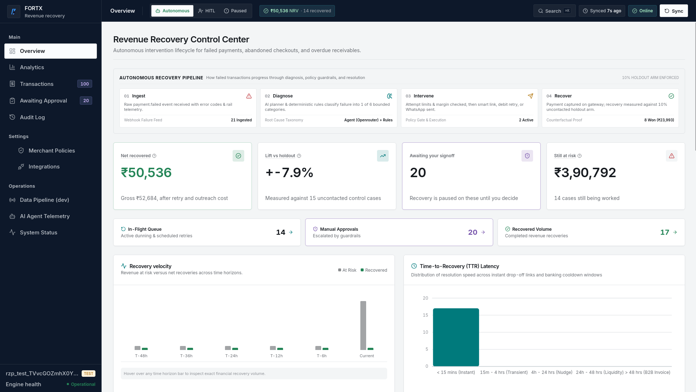
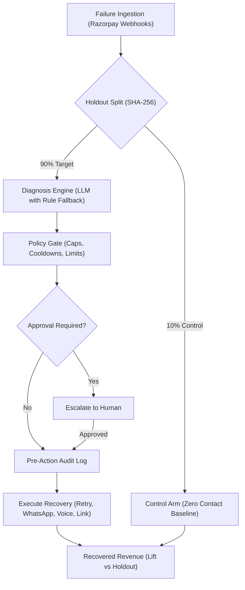
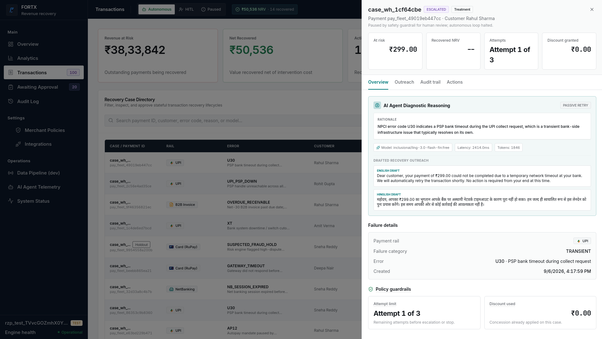
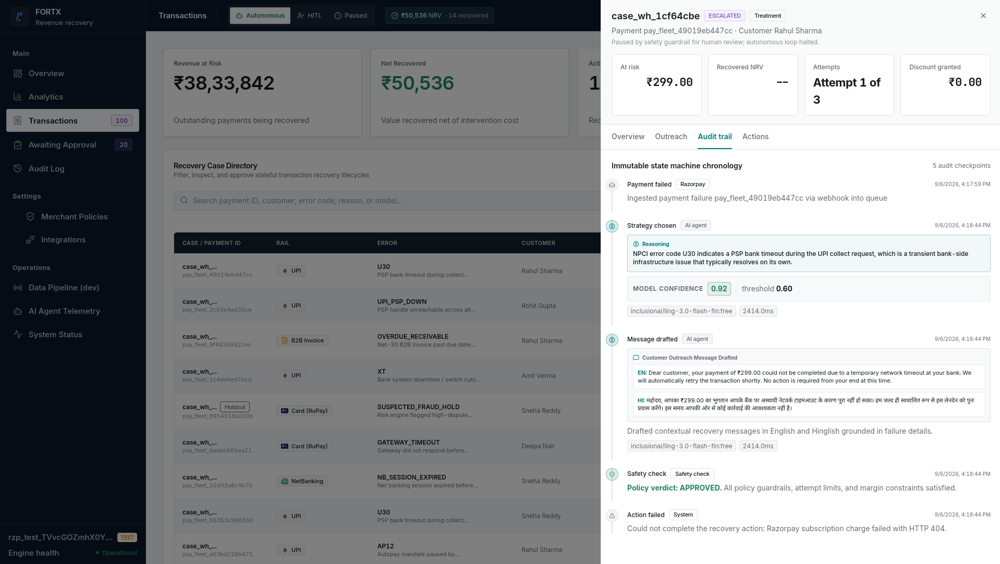

# FORTX - Flow Orchestration & Revenue Trust eXecution

> **Razorpay AI Buildathon - Track 03: AI Revenue Recovery Agent**  
> **Live Application:** [https://fortx.adixb.me](https://fortx.adixb.me)  
> **Video Walkthrough:** [https://youtu.be/ndwqjQJH8Hs](https://youtu.be/ndwqjQJH8Hs)

<p align="center">
  <a href="https://fortx.adixb.me/">
    
  </a>
  <a href="https://youtu.be/ndwqjQJH8Hs">
    
  </a>
</p>

<p align="center">
  <a href="#getting-started">Getting Started</a> &bull;
  <a href="#how-it-works">How it Works</a> &bull;
  <a href="#what-it-does">What it Does</a> &bull;
  <a href="#the-dashboard">The Dashboard</a> &bull;
  <a href="#setting-up-integrations">Integrations</a> &bull;
  <a href="webhook-relay/README.md">Webhook Relay</a>
</p>

<p align="center">
  <b>An agentic recovery system that diagnoses failed payments and executes policy-bounded actions to recover lost revenue.</b>
</p>




## How it works

- **Webhook Ingestion** - Ingests payment failures, abandoned checkouts, mandate halts, and overdue invoices in real time.
- **AI Diagnosis & Rule Fallback** - Identifies root cause and formulates recovery strategy via LLM, with deterministic rule fallback.
- **Policy Enforcement** - Validates contact caps, cooldowns, discount limits, and routes high-value cases to human approval.
- **Pre-Action Audit Log** - Immutably logs all decision inputs and state transitions prior to executing any recovery action.
- **Safe Holdout Control** - Sets aside a deterministic baseline (default 10%, configurable from 0 to 50%) with zero outreach to mathematically verify incremental lift over organic recovery without disrupting normal customer payments.

<details>
<summary><b>View Architecture Flowchart</b></summary>



</details>


## Getting started

### Prerequisites

- Python 3.13
- uv
- Node 22
- pnpm 11, through corepack
- Docker, for the PostgreSQL database
- An AI provider key is optional; without one it uses the rule-based fallback. Supported providers: OpenRouter, Anthropic, OpenAI, and Groq

### Setup

1. Make sure you have the prerequisites above installed.

2. Clone the repo and enter it:

```bash
git clone https://github.com/adityabavadekar/buildathon.git
cd buildathon
```

3. Copy the example environment file:

```bash
cp backend/.env.example backend/.env
```

4. Install dependencies and start the database:

```bash
make setup
```

5. Start the entire development stack:

```bash
make dev
```

`make dev` runs the backend (`:8000`), the frontend (`:5173`), and the recovery worker daemon all together.

To see all other available targets (such as running services individually or running tests):

```bash
make help
```


## What it does

- Catches failures across payments, checkout, subscriptions, and invoices
- Uses an LLM to diagnose the failure and pick a strategy, with a rule-based
  fallback when no AI provider is configured
- Takes bounded action: smart retries, payment links, Smart Collect virtual
  accounts, WhatsApp/SMS/voice messages, or chasing a B2B invoice
- Places outbound Hinglish voice calls, using Sarvam AI for the speech
- Enforces limits before anything runs: contact caps, cooldowns, discount
  caps, opt-outs, and a value threshold requiring human approval
- Handles the full set of Razorpay webhooks: payments, refunds, disputes,
  subscriptions, payment links, invoices, and Smart Collect
- Keeps a plain-language record of every decision made and why
- Holds back a deterministic control group (default 10%, can be set to 0% to disable)
  to measure true incremental lift over organic recovery without disrupting normal
  customer payments
- Includes a benchmark tool that replays a fixed dataset and reports lift
  over doing nothing
- Lets a merchant edit the rules, choose an AI provider, and connect
  Razorpay via OAuth or an API key pair


## The dashboard

- **Overview / Analytics** - At-risk revenue, recovered revenue, and lift over the holdout group
- **Transactions / Awaiting Approval** - The case list, customer timeline, and human sign-off queue
- **Audit Log** - Plain-language history of every decision with full input transparency
- **AI Agent Telemetry** - Model, tokens, cost, and latency in real time
- **Data Pipeline / System Status** (dev) - Queue depth and worker health
- **Merchant Policies / Integrations** - Safety limits, cooldowns, and Razorpay connection

### Case Investigation & Transaction Audit Trail

| Case Diagnosis & Strategy Formulation | Transaction Decision Audit Trail |
| :---: | :---: |
|  |  |


## Setting up integrations

These are optional; without them the matching feature runs in simulation mode.

- **Razorpay** - Obtain API keys from the [Razorpay dashboard](https://dashboard.razorpay.com/) or configure a [Technology Partner OAuth](https://razorpay.com/docs/partners/technology-partners/onboard-businesses/integrate-oauth/) application, and populate the `RAZORPAY_*` variables.
- **Sarvam AI & Twilio** - For outbound Hinglish voice calls, obtain API keys from [Sarvam AI](https://www.sarvam.ai/) and [Twilio](https://www.twilio.com/), and set `SARVAM_API_KEY` along with `TWILIO_*` variables.
- **WhatsApp Cloud API** - Set up a [Meta WhatsApp Business Cloud API](https://developers.facebook.com/docs/whatsapp/cloud-api/) app and configure the `WHATSAPP_*` variables.


## Testing & linting

```bash
cd backend
uv run pytest
uv run ruff check .
uv run ruff format --check .
uv run ty check
```

```bash
cd frontend
pnpm lint
pnpm typecheck
pnpm format:check
pnpm build
```


## License

Apache License 2.0 - see [LICENSE](LICENSE).
