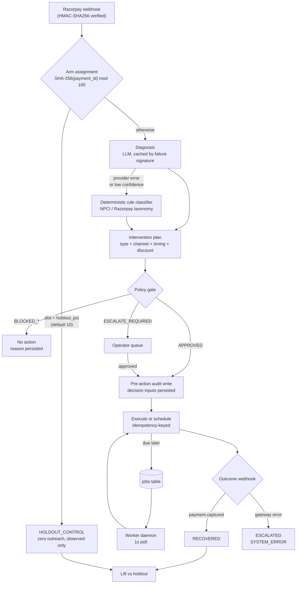
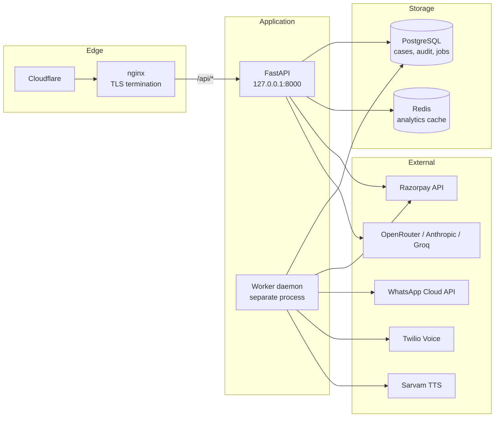
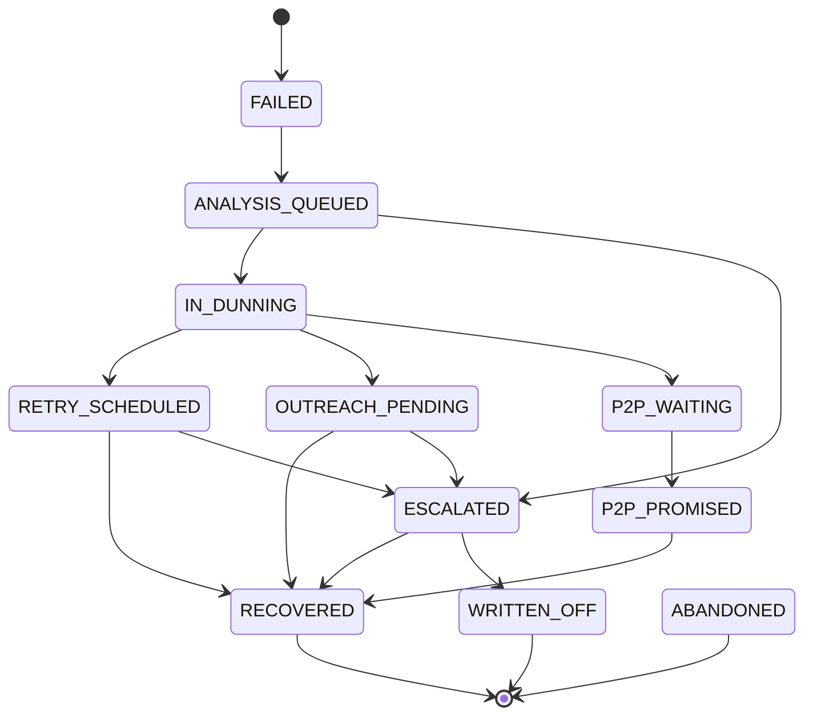

# FORTX Architecture

Technical reference for the FORTX revenue-recovery agent: how a payment failure
becomes a bounded, audited recovery action, and how the resulting recovery claim
is made falsifiable.

Audience: engineers reading or extending this codebase. For setup and product
framing see the [README](../README.md); for working rules see
[AGENTS.md](../AGENTS.md).

## Contents

- [System overview](#system-overview)
- [Technology stack](#technology-stack)
- [Request and decision flow](#request-and-decision-flow)
- [Service topology](#service-topology)
- [Component reference](#component-reference)
  - [Ingestion](#ingestion)
  - [Detection and diagnosis](#detection-and-diagnosis)
  - [Policy gate](#policy-gate)
  - [Intervention tools](#intervention-tools)
  - [Worker and job queue](#worker-and-job-queue)
  - [Audit trail](#audit-trail)
- [Feature reference](#feature-reference)
  - [The LLM agent](#the-llm-agent)
  - [The deterministic rule engine](#the-deterministic-rule-engine)
  - [Audit logs](#audit-logs)
  - [Campaigns](#campaigns)
  - [Operator console and autonomy modes](#operator-console-and-autonomy-modes)
  - [Rail health monitoring](#rail-health-monitoring)
  - [Pattern detection and clustering](#pattern-detection-and-clustering)
  - [Recovery propensity model](#recovery-propensity-model)
  - [Fleet simulator](#fleet-simulator)
  - [Hinglish voice recovery](#hinglish-voice-recovery)
  - [Razorpay OAuth onboarding](#razorpay-oauth-onboarding)
- [Data model](#data-model)
- [State machine](#state-machine)
- [Money handling](#money-handling)
- [Stopping rules and bounded action](#stopping-rules-and-bounded-action)
- [Measurement: holdout and counterfactual](#measurement-holdout-and-counterfactual)
- [API surface](#api-surface)
- [Configuration](#configuration)
- [Error taxonomy and failure modes](#error-taxonomy-and-failure-modes)
- [Use cases](#use-cases)
- [Running locally](#running-locally)
- [Deployment](#deployment)
  - [Full container stack](#full-container-stack)
  - [Host processes behind nginx](#host-processes-behind-nginx)
  - [Configuration that differs by environment](#configuration-that-differs-by-environment)
- [Testing and verification](#testing-and-verification)
- [References](#references)

## System overview

FORTX ingests revenue-at-risk events from Razorpay, classifies the cause,
selects one bounded intervention, executes it, and measures the outcome against
a holdout arm that receives no outreach.

Four properties constrain every design decision in this repository:

1. **Bounded action.** Every intervention has an explicit attempt cap, a
   cooldown, a discount ceiling, and an escalation path. There is no unbounded
   retry loop.
2. **Audit before action.** The decision inputs are persisted *before* the
   action is attempted, so the trail explains attempts that failed or were
   never completed.
3. **Falsifiable recovery.** A recovery figure is only quoted when a control
   comparator exists. The system reports "no attributable figure" rather than an
   unverifiable number.
4. **Exact money.** `Decimal` in Python, integer paise on the wire and in
   storage. No floats anywhere on the money path.

## Technology stack

| Layer | Choice | Why this one |
| --- | --- | --- |
| Language (backend) | Python 3.13 | Async ecosystem for provider SDKs; `Decimal` in the stdlib for exact money |
| API framework | FastAPI (`fastapi[standard-no-fastapi-cloud-cli]`) | Pydantic-validated request and response models, generated OpenAPI, native async |
| Validation and config | Pydantic v2, `pydantic-settings` | One typed `Settings` object validated at startup; no scattered `os.environ` reads |
| Database | PostgreSQL 16, SQLAlchemy 2.0 Core, `psycopg` 3 | ACID for the audit trail; JSONB for decision payloads; `pg_trgm` for free-text case search |
| Migrations | Alembic | Applied automatically at startup, so a deploy needs no separate step |
| Cache | Redis 7 (`redis-py` asyncio) | Read-through analytics cache only; fails open to direct recompute |
| LLM gateway | LiteLLM | One call signature across OpenRouter, Anthropic, OpenAI, and Groq, so provider fallback needs no per-SDK branching |
| Malformed-output repair | `json-repair` | Models emit near-JSON often enough that a repair pass beats discarding the response |
| HTTP client | `httpx2` | Starlette 1.6 deprecated `httpx`; used for both gateway calls and tests |
| Logging | `structlog` | Structured key-values, so `intervention.attempted` is queryable rather than grepped |
| Language (frontend) | TypeScript 6.0 | Pinned `<6.1`: typescript-eslint cannot yet support the TS 7 compiler API |
| UI framework | Next.js 15, React 19 | Single client-rendered dashboard; `output: standalone` for a dependency-free runtime image |
| Styling | Tailwind CSS 4 | CSS-first, tokens in `index.css` under `@theme`; no `tailwind.config.js` by design |
| Graph rendering | `@xyflow/react` | Case and workflow topology views |
| Icons and type | `lucide-react`, Inter, JetBrains Mono | Monospace with `tnum` for aligned money columns |
| Tooling | `uv`, `pnpm`, `ruff`, `ty`, `eslint strictTypeChecked`, `pytest` | Lockfile-pinned installs; lint, format, and type gates in CI |
| Runtime | Docker Compose, nginx, systemd | Compose for datastores and the full stack; nginx terminates TLS |

External services: Razorpay (payments, subscriptions, payment links, smart
collect, partner OAuth), Meta WhatsApp Cloud API, Twilio Programmable Voice,
Sarvam AI Bulbul TTS, and one of OpenRouter, Anthropic, OpenAI, or Groq for
inference.

## Request and decision flow



The critical ordering is `AUDIT` before `EXEC`. A crash between them leaves a
record of intent with no action taken, which is recoverable. The reverse order
would leave money moved with no record, which is not.

## Service topology



The API and worker are separate processes sharing one database. The worker is
not optional: without it, scheduled jobs stay `QUEUED` forever and the backlog
grows even with no traffic.

Redis is a read-through cache for analytics aggregation only. It fails open - an
unreachable Redis produces a slower direct recompute, never an error.

## Component reference

### Ingestion

`api/routes/webhooks.py` is the only inbound path for real events.

**Endpoint:** `POST /api/webhooks/razorpay`, returning `202 Accepted`. The 202 is
deliberate: Razorpay retries on non-2xx, so the endpoint acknowledges receipt
once the event is durably recorded rather than holding the connection open for
downstream processing.

**Signature verification** runs before the body is parsed as JSON, so an
unauthenticated payload never reaches the parser:

1. Read the raw request body as bytes. Verification must use the exact bytes
   Razorpay signed - re-serializing parsed JSON changes key order and whitespace
   and breaks the digest.
2. Compute `HMAC-SHA256(secret, raw_body)` and compare hex digests against the
   `X-Razorpay-Signature` header using `hmac.compare_digest`, which is constant
   time and does not leak the correct prefix through timing.
3. A signature that fails comparison returns `401`. A **missing** header returns
   `401` when `APP_ENV=production`, but is allowed through in local and CI
   environments so replayed fixtures can be tested without a secret.

The secret is resolved through `resolve_webhook_secret()` in
`core/credential_resolver.py`, which prefers a credential imported into
`gateway_credentials` over the environment value, so a merchant onboarded at
runtime verifies against its own secret without a redeploy.

**Configured-secret precondition.** Verification is skipped entirely when no
secret is configured anywhere. A deployment that forgets `RAZORPAY_WEBHOOK_SECRET`
therefore accepts unsigned webhooks. This is intentional for local development
and is the single most important thing to set before pointing a live account at
this endpoint.

**Replay and duplicate handling.** Razorpay delivers at-least-once, so the same
event can arrive twice:

- Case creation is keyed on `payment_id`. A second `payment.failed` for a case
  already past `ANALYSIS_QUEUED` returns the existing case instead of opening a
  duplicate.
- Refund and dispute events are guarded by `_already_logged_by_id()`, which
  checks whether that exact refund or dispute id has already produced the same
  audit event on that case, so a redelivery cannot double-book a refund against
  recovered revenue.
- Money-affecting outbound actions carry their own idempotency key, persisted in
  `idempotency_keys` with `ON CONFLICT DO NOTHING`, so a retried delivery cannot
  double-charge.

**Local development** uses `webhook-relay/`, which fans a single public tunnel
out to several local listeners; Razorpay allows one URL per event subscription.

Events consumed:

| Event | Meaning |
| --- | --- |
| `payment.failed` | Primary failure trigger |
| `payment.captured` | Recovery confirmation |
| `order.paid` | Recovery confirmation via order |
| `subscription.halted` | Mandate failure trigger |
| `subscription.charged` | Renewal recovery confirmation |
| `subscription.cancelled`, `subscription.completed` | Lifecycle close |
| `invoice.paid`, `invoice.partially_paid`, `invoice.expired` | Receivables |
| `invoice.paid_reconciled` | Reconciliation of an indeterminate charge |
| `payment.dispute.*` | Dispute lifecycle (created, under review, won, lost, closed, action required) |

`api/routes/simulation.py` and the fleet generator provide synthetic events for
demos and load testing. They never touch live customer records.

### Detection and diagnosis

`detection/` classifies a raw failure into a `FailureCategory`:

| Category | Interpretation |
| --- | --- |
| `TRANSIENT_BANK_WINDOW` | Bank-side timing; retry after the window |
| `LIQUIDITY_CONSTRAINT` | Insufficient funds; retry near a salary cycle |
| `STRUCTURAL_MANDATE_FAILURE` | Mandate revoked or invalid; retry cannot succeed |
| `CHECKOUT_DROP_OFF` | Abandoned checkout; short-validity link |
| `PROMISE_TO_PAY_DELAY` | Customer committed to a date |
| `B2B_RECEIVABLES_OVERDUE` | Invoice past due on a long collection cycle |
| `SYSTEMIC_GATEWAY_FAILURE` | Rail-wide degradation; suppress per-case action |
| `INDETERMINATE_AUTHORIZATION` | Outcome unknown; reconcile before any retry |
| `UNCLASSIFIED` | No confident classification |

`INDETERMINATE_AUTHORIZATION` is the category that prevents double-charging: a
gateway timeout means the authorization may already have succeeded, so the case
is routed to reconciliation rather than retried.

`llm/client.py` is the **only** module permitted to call a provider SDK. It
centralises cost accounting, latency telemetry, provider fallback, and audit
capture of model outputs. Provider order is configurable and persisted in
`llm_settings`; the chain ends in a deterministic rule classifier that always
succeeds offline.

`llm/diagnosis_cache.py` keys on the failure signature (error code, rail, amount
band) so structurally identical failures reuse one diagnosis instead of issuing
a fresh call per event. TTL defaults to 1800s.

### Policy gate

`intervention/policy_gate.py` is a deterministic pre-execution check. It returns
a `PolicyCheckResult` and never mutates state:

| Result | Trigger |
| --- | --- |
| `APPROVED` | All invariants satisfied |
| `BLOCKED_MAX_RETRIES` | Attempt cap reached (default 3) |
| `BLOCKED_COOLDOWN` | Inside the cooldown window (default 24h) |
| `BLOCKED_MARGIN_CAP` | Discount exceeds ceiling (default 1000 bps) |
| `BLOCKED_OPT_OUT` | Customer opted out of contact |
| `BLOCKED_LOW_CONFIDENCE` | Below `MIN_CONFIDENCE_THRESHOLD` (0.60) |
| `BLOCKED_CHANNEL` | Channel not permitted by policy |
| `ESCALATE_REQUIRED` | Needs human judgment |
| `HOLDOUT_CONTROL` | Case is in the control arm |

Because the gate is deterministic and separate from the LLM, a model that
proposes an out-of-policy action cannot execute one. The gate, not the model, is
the safety boundary.

### Intervention tools

Each tool in `intervention/tools/` implements one action behind a common
interface. Selection is by `InterventionType`:

| Type | Tool | Effect |
| --- | --- | --- |
| `PASSIVE_RETRY` | `mandate_retry.py` | Re-attempt subscription debit |
| `SMART_RETRY` | `mandate_retry.py` | Re-attempt with backoff timed to cause |
| `SMART_PAYMENT_LINK` | `payment_link.py` | Razorpay payment link |
| `INCENTIVIZED_LINK` | `payment_link.py` | Link with bounded discount |
| `CUSTOMER_NUDGE` | `notification.py`, `whatsapp_business.py`, `voice_call.py` | Outreach without a new charge |
| `SMART_COLLECT` | `smart_collect.py` | Virtual account for B2B transfer |
| `B2B_INVOICE_CHASER` | `notification.py` | Invoice follow-up on a receivables cycle |
| `P2P_FOLLOWUP` | `notification.py` | Follow up a promise-to-pay commitment |
| `MANUAL_ESCALATION` | - | Operator queue |
| `NO_ACTION` | - | Deliberate no-op, recorded with reason |

Mandate retry backoff follows NPCI and bank practice: `[4, 24, 72]` hours for
UPI Autopay, `[24, 72, 120]` for eNACH, with the final value repeating past the
list length.

Voice calls pre-generate Hinglish audio through Sarvam Bulbul before Twilio
dials. Twilio's own `<Say>` cannot code-switch within one utterance, and
pre-generation moves TTS failure before the phone rings rather than mid-call.

### Worker and job queue

`worker/main.py` runs `worker/executor.py` on a 1s poll. Beyond executing due
jobs it performs periodic maintenance, swept hourly rather than per tick:

- `recover_stuck_jobs()` returns jobs abandoned mid-`PROCESSING` to the queue.
- `abandon_stale_cases()` closes cases past `MAX_DUNNING_LIFECYCLE_DAYS` (7).
- `_check_p2p_followup()` follows up promise-to-pay commitments.

Job states: `QUEUED`, `PROCESSING`, `DONE`, `FAILED`, `DEAD`. `DEAD` is terminal
after exhausted retries and is intentionally distinct from `FAILED` so a
permanent failure is not retried forever.

### Audit trail

`audit/` persists every state transition with actor, reason, timestamp, and the
decision inputs and outputs that produced it. Actors are a strict enum:
`SYSTEM`, `AGENT_LLM`, `POLICY_GATE`, `HUMAN_OPERATOR`, `GATEWAY_WEBHOOK`.

Two properties make the trail usable as evidence rather than logging:

- Writes happen **before** the action, so failed and abandoned attempts appear.
- LLM outputs are persisted verbatim with the model id and token counts, so a
  past decision can be re-read exactly as the model produced it.

`audit/global_log.py` records system-level events not tied to a case (operator
login, mode changes) under the `SYSTEM_GLOBAL` case id.

## Feature reference

### The LLM agent

**Module:** `llm/planner.py`, calling through `llm/client.py`. It answers one
question per event: *what is wrong, and what single bounded action should follow?*

**Input.** Exactly nine fields, assembled in `plan_recovery()`. Nothing else
about the customer or merchant is sent:

```json
{
  "payment_id": "pay_...",
  "amount_paise": 249900,
  "currency": "INR",
  "rail": "UPI_AUTOPAY",
  "error_code": "AP15",
  "error_reason": "insufficient_funds",
  "error_step": "authorization",
  "error_source": "bank",
  "npci_code": "AP15"
}
```

The prompt is deliberately narrow: identifiers and failure metadata only, no
names, contact details, or transaction history. The customer profile is applied
*after* the model returns, by deterministic code, so personal data never enters a
provider request.

**Output.** A single JSON object, validated into `LLMDiagnosisPlan`. Fields with
constraints, enforced by Pydantic rather than trusted from the model:

| Field | Type | Constraint |
| --- | --- | --- |
| `category` | `FailureCategory` | Must be a taxonomy member |
| `confidence` | `Decimal` | 0.0-1.0; below 0.60 routes to escalation |
| `intervention_type` | `InterventionType` | Must be a known tool |
| `delay_hours` | `int` | >= 0 |
| `discount_bps` | `int` | 0-5000, and re-checked against the 1000 bps policy ceiling |
| `channel` | `OutreachChannel \| None` | WhatsApp, SMS, email, or voice |
| `reasoning` | `str` | One-sentence rationale, persisted to the audit trail |
| `dunning_message_en` | `str \| None` | Customer-facing English copy |
| `dunning_message_hi` | `str \| None` | Hinglish copy in Latin script |

**Confidence is instructed to be calibrated, not decorative.** The prompt bands
it explicitly: 0.85-0.98 only when an error code maps unambiguously to one
category, 0.60-0.84 when the signal is suggestive but generic, below 0.60 when
guessing. The prompt states that low confidence routes to human escalation and
asks the model to use it honestly rather than inflating it to avoid escalation.

**Output parsing is defensive.** `_extract_json_block()` strips markdown fences
and reasoning tags, then attempts `json.loads`, then falls back to `json_repair`.
Models emit near-JSON often enough that discarding a repairable response would
lose a usable diagnosis. A response that still will not parse is treated as a
provider failure and falls through to the rule engine.

**What the model cannot do.** It proposes; it does not execute. The returned plan
passes through the policy gate before any action, so a model that suggests a 40%
discount, a fourth retry, or a channel the customer opted out of is blocked by
deterministic code. The gate, not the prompt, is the safety boundary.

**Cost and audit.** Every call records model id, provider, input and output token
counts, latency, and cost through `llm/client.py`. The verbatim request prompt
and response content are persisted with the case, so a past decision can be
re-read exactly as the model produced it. `GET /api/settings/llm-report` exposes
per-model call counts, success versus fallback counts, latency percentiles, and
spend.

**Caching.** `llm/diagnosis_cache.py` keys on `(error_code, rail, amount band,
...)` - the failure *signature*, not the payment id. Structurally identical
failures reuse one diagnosis for the TTL window (1800s default). This is why a
1200-event benchmark issues far fewer than 1200 model calls. Set
`APP_LLM_DIAGNOSIS_CACHE_ENABLED=false` to force every event through a live call.

### The deterministic rule engine

**Module:** `detection/classifier.py`. It is not a stub or a placeholder: it is a
complete classifier that produces the same `DiagnosisResult` shape as the LLM
path, and it is what runs whenever a provider is unavailable, unconfigured, or
returns something unusable. The benchmark's default mode uses it exclusively, so
a reproducible run needs no API key and costs nothing.

Classification is by exact-match code sets, checked in a fixed order. Exact match
rather than substring is deliberate: an exhaustive list is only trustworthy if a
near-miss reason falls through to `UNCLASSIFIED` instead of silently matching the
wrong category.

| Code set | Members | Category |
| --- | --- | --- |
| `INDETERMINATE_ERROR_CODES` | `GATEWAY_TIMEOUT`, `REQUEST_TIMEOUT`, `NETWORK_ERROR`, `CONNECTION_RESET` | `INDETERMINATE_AUTHORIZATION` |
| `TRANSIENT_ERROR_CODES` | `U30`, `U31`, `U32`, `NB_SESSION_EXPIRED` | `TRANSIENT_BANK_WINDOW` |
| `LIQUIDITY_NPCI_CODES` | `AP15`, `AP21`, `U19`, `U68`, `ZM`, `CARD_LIMIT_EXCEEDED`, `ENACH_INSUFFICIENT_FUNDS` | `LIQUIDITY_CONSTRAINT` |
| `MANDATE_FAIL_NPCI_CODES` | `AP09`, `AP10`, `AP12`, `AP24`, `VA`, `FL`, `K1`, `MD01`, `MD02`, `CARD_EXPIRED` | `STRUCTURAL_MANDATE_FAILURE` |
| `SYSTEMIC_ERROR_CODES` | `GATEWAY_ERROR`, `SERVER_ERROR`, `INTERNAL_SERVER_ERROR`, `NB_BANK_UNAVAILABLE`, `UPI_PSP_DOWN` | `SYSTEMIC_GATEWAY_FAILURE` |
| `CHECKOUT_ABANDON_ERROR_CODES` | `OTP_TIMEOUT`, `UPI_COLLECT_DECLINED` | `CHECKOUT_DROP_OFF` |

Codes are NPCI response codes and Razorpay error codes taken from Razorpay's
published error lists, mapped into the nine-category taxonomy.

**Indeterminate is checked first, and that ordering is the point.** A timeout
never reports whether authorization succeeded, so the payment may already have
gone through. If a later branch claimed it first, the engine would retry and
double-charge. It is checked before everything else so it cannot be
misclassified.

**Liquidity decisions read customer history.** `_liquidity_result()` weighs prior
liquidity failures against that customer's recovery rate: a first-time
insufficient-funds failure is treated as a timing problem and retried near a
salary cycle, while repeated failures against a thin recovery history escalate
rather than retrying into another decline. This is why two identical `AP15`
events can produce different plans.

**Fall-through is `UNCLASSIFIED` with `MANUAL_ESCALATION`.** An unrecognised
failure becomes a human's decision, never a guessed action.

### Audit logs

Every state transition writes a row before the action it describes. A row
carries: case id, timestamp (UTC), actor, event name, from-state, to-state,
reason, and the full `decision_inputs` and `decision_outputs` JSON that produced
it - including verbatim LLM output where a model was involved.

Actors are a strict enum, so "who did this" is never ambiguous: `SYSTEM`,
`AGENT_LLM`, `POLICY_GATE`, `HUMAN_OPERATOR`, `GATEWAY_WEBHOOK`.

Three design choices make the trail evidence rather than logging:

- **Written before the attempt.** A failed or abandoned action still leaves a
  record of what was intended and why, which is exactly the case a
  post-hoc log loses.
- **Append-only.** Transitions are added, never rewritten, so history cannot be
  edited to match an outcome.
- **Decision inputs, not just outcomes.** The trail answers "why did it do that"
  rather than only "what happened".

System-level events with no case (operator login, autonomy mode change) are
recorded by `audit/global_log.py` under the reserved `SYSTEM_GLOBAL` case id, so
the operator's own actions are audited alongside the agent's.

Read via `GET /api/cases/{case_id}` for one case's trail, or
`GET /api/cases/audit/global` for system events.

### Campaigns

Recovery attribution grouped by the campaign that produced the payment. FORTX
does not create campaigns; it reads a campaign identifier off the Razorpay
payment and reports recovery performance per campaign, so a merchant can see
which acquisition source produces revenue that needs recovering.

The identifier is extracted from Razorpay `notes` and `metadata`, accepting
`recovery_campaign`, `campaign_id`, `utm_campaign`, or `campaign` as key names,
since merchants tag inconsistently.

`GET /api/analytics` returns `campaign_metrics[]`, each entry carrying
`campaign_id`, total, recovered, and escalated case counts, at-risk and recovered
paise, net recovered value, recovery rate, and average ticket size.

### Operator console and autonomy modes

`operator_mode` gates how much the agent may do unattended:

| Mode | Behaviour |
| --- | --- |
| `FULL_AUTONOMY` | Policy-approved plans execute immediately |
| `HUMAN_IN_THE_LOOP` | Every plan waits for operator approval before execution |
| `MONITORING_ONLY` | Detection and diagnosis continue; no intervention executes |

Mode changes are audited with the operator as actor. `HUMAN_IN_THE_LOOP` is the
mode to demonstrate when the question is whether the gate genuinely holds.

### Rail health monitoring

`detection/rail_health.py` tracks per-rail failure rates against a baseline and
classifies each rail's state. When a rail is degraded, per-case interventions are
suppressed: retrying into a broken rail manufactures gateway cost and customer
contact without recovering anything, and a rail-wide spike is not a per-customer
problem. Exposed at `GET /api/rails/health`.

### Pattern detection and clustering

`detection/clustering.py` groups failures sharing a signature to surface an
emerging systemic issue before it is visible case by case. Detected clusters are
persisted as `pattern_alerts` and served from `GET /api/analytics/patterns`, with
`POST /api/analytics/patterns/recompute` to force a pass.

### Recovery propensity model

`detection/ml.py` trains a recovery-likelihood model on completed cases,
persisted in `ml_models` with predictions in `ml_predictions` and accuracy
telemetry in `model_telemetry`. It informs prioritisation; it does not authorise
action, and the policy gate applies regardless of its score. Trained through
`POST /api/analytics/recovery-model/train`; status at
`GET /api/analytics/recovery-model`, which reports `untrained` honestly rather
than serving a default-valued model.

### Fleet simulator

`simulation/fleet.py` generates synthetic failure events at a configurable rate
(up to 500/minute) across all rails and categories, for demonstrating throughput
without live traffic. `APP_FLEET_TIME_COMPRESSION` divides intervention delays so
a queue visibly drains during a demo: real delays are correct but a 4h bank
cutoff leaves nothing due for hours, which looks like a stalled worker.

Synthetic events are marked as such and their executions are counted separately
in analytics (`simulated_executions`, `simulated_cost_paise`), so a demo can
never be mistaken for recovered revenue.

### Hinglish voice recovery

`intervention/tools/voice_call.py` places outbound recovery calls through Twilio.
Audio is pre-generated by Sarvam Bulbul TTS rather than synthesized live by
Twilio's `<Say>`, for two reasons: `<Say>` forces one language per utterance and
cannot code-switch mid-sentence, which Hinglish requires; and pre-generation
moves TTS failure to before the phone rings instead of mid-call. Twilio fetches
the audio from `GET /api/voice-audio/{token}.mp3`, which is unauthenticated
because Twilio cannot present a session cookie.

Falls back to Twilio `<Say>` when `SARVAM_API_KEY` is unset. With no Twilio
credentials the channel is unavailable rather than reporting a call that never
happened.

### Razorpay OAuth onboarding

`integrations/razorpay_oauth.py` supports partner OAuth so a merchant can connect
its own account without pasting API keys. Tokens are stored in
`oauth_connection`, refreshed within `OAUTH_REFRESH_WINDOW_DAYS` (7) of expiry,
and `account.app.authorization_revoked` deletes the row - a revoked app's tokens
are already dead at Razorpay, and keeping them would leave the engine
authenticating with a credential that cannot work.

## Data model

PostgreSQL, migrations in `backend/alembic/versions/`.

| Table | Purpose |
| --- | --- |
| `cases` | Recovery case aggregate: amount, state, arm, diagnosis, timing |
| `audit` | Append-only transition and decision log |
| `jobs` | Durable scheduled work with lease semantics |
| `idempotency_keys` | Uniqueness guard for money-affecting actions |
| `merchant_policy` | Caps, cooldowns, discount ceiling, holdout percentage |
| `operator_mode` | Autonomy level (full, approval-required, paused) |
| `llm_settings` | Provider chain, active models, temperature, timeout |
| `gateway_credentials` | Encrypted Razorpay credentials |
| `oauth_connection`, `oauth_auth_state` | Razorpay partner OAuth |
| `ml_models`, `ml_predictions`, `model_telemetry` | Recovery-propensity model and telemetry |
| `pattern_alerts` | Detected failure clusters |
| `workflows`, `workflow_events`, `workflow_signals`, `workflow_template_definitions` | Workflow engine state |

Money columns are integer paise (`amount_paise`, `recovered_amount_paise`,
`net_recovered_value_paise`, `discount_paise_granted`). Timestamps are
`TIMESTAMPTZ`, always UTC, converted only for display.

Search-heavy columns carry `pg_trgm` GIN indexes because the free-text filter
uses leading-wildcard `ILIKE`, which a btree index cannot serve.

## State machine

`audit/state_machine.py` enforces transitions through `VALID_TRANSITIONS`. An
illegal transition raises `InvalidStateTransitionError` rather than silently
corrupting the case.



`RECOVERED`, `ABANDONED`, and `WRITTEN_OFF` are terminal. Escalating requires an
`EscalationReason` (`HUMAN_JUDGMENT` or `SYSTEM_ERROR`); the transition is
rejected without one, so no case reaches the operator queue unexplained.

## Money handling

Rules enforced throughout `backend/src/app/`:

- **Integer paise on the wire and in storage; `Decimal` in Python.** Floats lose
  paise silently, and a lost paise in a reconciliation report is a defect.
- **Every amount carries an explicit currency.** A bare number is a bug.
- **Timezone-aware UTC everywhere.** Settlement and cutoff logic is wrong
  without it.
- **Idempotency keys on every money-affecting action.** A retried request cannot
  double-charge or double-refund; keys are persisted in `idempotency_keys` with
  `ON CONFLICT DO NOTHING`.
- **Cost is booked, not assumed.** Gateway retries (INR 2.50), WhatsApp (INR
  0.50), SMS (INR 0.20), email (INR 0.05), and voice (INR 1.50) are attributed
  to the treatment arm so net recovery is net of what it cost to recover.

## Stopping rules and bounded action

An intervention loop without a terminating condition is not a recovery strategy,
it is a way to spend gateway fees and exhaust a customer's patience. Every loop
in this system has an explicit bound, enforced in a different place so no single
bug removes them all.

| Bound | Value | Enforced in | Effect when reached |
| --- | --- | --- | --- |
| Attempt cap | 3 (`max_attempts`, 1-10) | Policy gate | `BLOCKED_MAX_RETRIES`; no further action on the case |
| Cooldown between attempts | 24h (`min_cooldown_hours`) | Policy gate | `BLOCKED_COOLDOWN` until the window passes |
| Mandate retry backoff | `[4, 24, 72]`h UPI Autopay, `[24, 72, 120]`h eNACH | `mandate_backoff.py` | Escalating spacing; final value repeats, never shortens |
| Discount ceiling | 1000 bps (10%) | Policy gate | `BLOCKED_MARGIN_CAP`; plan rejected, not silently clamped |
| Confidence floor | 0.60 | Policy gate | `BLOCKED_LOW_CONFIDENCE`; routed to a human instead of acting on a guess |
| Case lifetime | 7 days (`MAX_DUNNING_LIFECYCLE_DAYS`) | Worker sweep | Case moves to `ABANDONED` |
| Contact opt-out | per customer | Policy gate | `BLOCKED_OPT_OUT`; no channel may be used |
| Job retry limit | per job | Worker | Job becomes `DEAD`, distinct from `FAILED`, and is not retried |
| Rail suppression | failure-rate spike | `rail_health.py` | Per-case interventions suppressed while a rail is degraded |

Three of these are worth stating as reasoning rather than configuration:

- **A structural mandate failure is never retried.** A revoked mandate cannot
  succeed, so retrying it converts a known-dead case into gateway spend. It
  escalates on the first diagnosis instead of consuming the attempt budget.
- **An indeterminate authorization is never retried.** A gateway timeout leaves
  the outcome unknown, and retrying risks a second charge for one purchase. The
  case is reconciled against the gateway first, which is the one place where
  doing nothing is strictly safer than acting.
- **Escalation is a terminating path, not a queue to drain.** `ESCALATED`
  requires an `EscalationReason`, and its only exits are `RECOVERED` or
  `WRITTEN_OFF`. A case cannot loop back into automated dunning after a human
  has taken it.

**Escalation triggers** are `HUMAN_JUDGMENT` (value threshold, low confidence, or
policy requiring approval) and `SYSTEM_ERROR` (an intervention that could not be
completed, such as a gateway rejection). Both persist the decision inputs that
led there, so the operator sees what was attempted and why it stopped.

Autonomy is itself bounded: `operator_mode` supports `FULL_AUTONOMY`,
`HUMAN_IN_THE_LOOP`, and `MONITORING_ONLY`. In `HUMAN_IN_THE_LOOP` every plan
waits for a human before execution; in `MONITORING_ONLY` diagnosis continues but
nothing executes.

## Measurement: holdout and counterfactual

A recovery claim needs a comparator, or it is an assertion.

**Arm assignment** is `SHA-256(stable_payment_key(payment_id)) mod 100 <
holdout_percentage`. Deterministic, so a replay keeps each case in the same arm
and lift stays comparable across runs. Default holdout is 10%, configurable 0-50.

**The holdout arm receives zero outreach.** Its recoveries are organic, and the
difference between arms is the attributable lift.

**The coverage gate** is what makes the number honest. Attributable money is
quoted only when enough treatment value has a control comparator meeting the
per-category case floor. Below the coverage threshold the report states that no
attributable figure is available and says why, rather than quoting a lift
computed from too little data.

`benchmark/` replays a fixed seeded dataset (`fortx-bench-v1`, seed `20260902`)
through the real engine and writes a timestamped report to `docs/benchmarks/`.
`--use-llm` routes planning through the model; the default is deterministic
rules so a run is reproducible and free.

**Reading the two lift figures.** The report quotes both a percentage-point rate
lift and an attributable money figure, and they can disagree in sign. The rate
lift counts cases; the money figure applies each category's control recovery
*probability* to treatment at-risk *amounts*, then subtracts that predicted
baseline from what treatment actually recovered. A run can therefore recover a
larger share of cases while recovering a smaller share of value, if the control
arm happened to recover proportionally more in high-ticket categories. When the
two disagree, the money figure is the conservative one and the rate lift alone
should not be quoted as recovery.

The holdout arm is also small by construction: a 10% holdout over 1200 events is
120 cases spread across nine categories, so each control probability rests on
8-24 cases. The `MIN_CONTROL_CASES_PER_STRATUM` floor excludes the thinnest
strata rather than estimating from them, which biases the counterfactual high -
deliberately, since overstating the baseline understates the agent's claim.
Reading a single run's money figure as precise would be a mistake; it is a
bounded, conservative estimate with a stated coverage percentage.

## API surface

Backend on `:8000`, all routes under `/api`. `GET /health` is also exposed
unprefixed.

| Prefix | Module | Responsibility |
| --- | --- | --- |
| `/auth` | `auth.py` | Operator session (unauthenticated by necessity) |
| `/webhooks` | `webhooks.py` | Razorpay ingress (HMAC-authenticated) |
| `/voice-audio` | `voice_audio.py` | TTS audio for Twilio (no cookie possible) |
| `/cases` | `cases.py` | Case list, detail, audit trail, SSE stream |
| `/customers` | `customers.py` | Customer profiles and contact history |
| `/analytics` | `analytics.py` | Aggregates, forecast, patterns, escalations |
| `/policies` | `policies.py` | Merchant policy read and update |
| `/rails` | `rail_health.py` | Per-rail failure rates and degradation state |
| `/pipeline` | `pipeline.py` | Queue depth, throughput, fleet control, SSE |
| `/operator` | `operator.py` | Autonomy mode and approval queue |
| `/experiments` | `experiments.py` | Arm configuration and results |
| `/settings` | `settings.py` | Environment, credentials, LLM config, cost report |
| `/benchmark` | `benchmark.py` | Trigger and read benchmark runs |
| `/simulation` | `simulation.py` | Synthetic event generation, reset |
| `/integrations` | `integrations.py` | Razorpay OAuth connect and status |

**Routes are unauthenticated unless a dependency authenticates them.** Everything
except `/auth`, `/webhooks`, and `/voice-audio` is registered with
`Depends(require_operator)`, so a route added later is protected by default. The
three exceptions are deliberate: the dashboard must ask whether login is
required before it has a session, webhooks authenticate by HMAC, and Twilio
cannot present a cookie.

Two endpoints stream Server-Sent Events: `/api/cases/stream` and
`/api/pipeline/stream`. Any reverse proxy in front of them must disable response
buffering, or events are held until a buffer fills.

## Configuration

Every knob is a field on `Settings` in `core/config.py`. **No module outside
that file reads `os.environ`**, so configuration is discoverable in one place and
validated at startup.

| Variable | Default | Effect |
| --- | --- | --- |
| `APP_ENV` | `local` | `local`, `ci`, or `production`; gates cookie `Secure` and CORS regex |
| `APP_CORS_ORIGINS` | `["*"]` | Browser origin allowlist |
| `APP_OPERATOR_PASSWORD` | `admin` | Shared operator password; **empty disables the gate entirely** |
| `APP_SESSION_SECRET` | unset | HMAC key for session cookies; unset means a random per-process key |
| `APP_PUBLIC_BASE_URL` | `http://127.0.0.1:5173` | Origin for OAuth callbacks and Twilio-fetched audio |
| `DATABASE_URL` | local Postgres | PostgreSQL DSN |
| `REDIS_URL` | local Redis | Analytics cache DSN |
| `OPENROUTER_API_KEY`, `OPENROUTER_MODEL` | unset | Primary LLM provider |
| `ANTHROPIC_API_KEY`, `GROQ_API_KEY`, `OPENAI_API_KEY` | unset | Fallback providers |
| `RAZORPAY_KEY_ID`, `RAZORPAY_KEY_SECRET` | unset | Gateway credentials |
| `RAZORPAY_WEBHOOK_SECRET` | unset | HMAC verification key |
| `WHATSAPP_*`, `TWILIO_*`, `SARVAM_*` | unset | Outreach channels; each fails closed rather than faking delivery |
| `APP_FLEET_TIME_COMPRESSION` | `1` | Divides intervention delays for demo runs; 1 disables |

An unset channel credential makes that channel unavailable rather than
simulating a delivered message. A demo that appears to send WhatsApp messages
without credentials would be reporting outreach that never happened.

## Error taxonomy and failure modes

Typed exceptions:

| Exception | Raised when |
| --- | --- |
| `RazorpayGatewayError` | Gateway call fails or returns a non-success status |
| `InvalidStateTransitionError` | A transition violates `VALID_TRANSITIONS` |
| `OAuthError` | Partner OAuth exchange or refresh fails |
| `CredentialCsvError` | Credential import file is malformed |

Degradation behaviour, by dependency:

| Dependency | On failure | Consequence |
| --- | --- | --- |
| LLM provider | Next provider, then deterministic rules | Diagnosis continues; `fallback_reason` recorded |
| Redis | Fails open to direct recompute | Slower analytics, no error |
| Razorpay API | `RazorpayGatewayError` -> case `ESCALATED` with `SYSTEM_ERROR` | No money moves; attempt is audited |
| Outreach channel | Channel unavailable | No message sent, and none claimed |
| Worker process | Jobs remain `QUEUED` | Backlog grows; nothing is lost or double-run |
| PostgreSQL | Startup fails, requests error | Hard dependency by design; the audit trail cannot be optional |

Two failure modes worth naming explicitly, because both look like success:

- **Synthetic identifiers against a live gateway.** Benchmark and fleet events
  carry generated `sub_*` and `pay_*` ids. A live Razorpay account does not know
  them, so charge attempts return HTTP 404 and every case escalates with
  `SYSTEM_ERROR`. The run completes and the report renders, but the recovery
  rate then measures the gateway environment, not the agent. Interpret any run
  whose escalations are dominated by `SYSTEM_ERROR` accordingly.
- **Gateway rate limiting.** A high-volume replay against live credentials can
  hit HTTP 429, producing the same near-zero recovery rate for an entirely
  environmental reason.

## Use cases

**Failed one-off payment.** `payment.failed` arrives. Diagnosis distinguishes a
transient bank window from insufficient funds. The former is retried after the
window; the latter is timed toward a salary cycle or converted to a payment
link. A gateway timeout instead yields `INDETERMINATE_AUTHORIZATION` and goes to
reconciliation, because retrying an unknown-outcome authorization risks charging
twice.

**Halted subscription mandate.** `subscription.halted` arrives. A revoked
mandate is `STRUCTURAL_MANDATE_FAILURE` and is escalated rather than retried -
retrying a dead mandate cannot succeed and burns gateway fees. A recoverable
mandate is retried on the rail-appropriate backoff.

**Abandoned checkout.** A short-validity payment link is issued while intent is
fresh (`CHECKOUT_DROP_OFF_LINK_VALIDITY_MINUTES`, 15). Past that, a nudge
replaces the link.

**Overdue B2B receivable.** Long collection cycles use `SMART_COLLECT` to issue
a virtual account for bank transfer, with promise-to-pay tracking
(`P2P_WAITING` -> `P2P_PROMISED`) and follow-up at
`P2P_DEFAULT_FOLLOWUP_HOURS` (72).

**Systemic rail degradation.** When `rail_health` sees a rail-wide failure-rate
spike, per-case interventions are suppressed. Retrying into a broken rail
manufactures cost and customer contact without recovering anything.

**Proving recovery.** `make benchmark` replays the fixed dataset, scores both
arms, and writes a report with lift, counterfactual coverage, and cost. If
coverage is below threshold the report says no attributable figure is available.

## Running locally

Development, not deployment. The backend and worker run on the host; only the
datastores are containerised.

```bash
make db-up        # postgres + redis via docker-compose.dev.yml
make dev          # backend :8000, frontend :5173, worker
```

`make dev` is a development server: it reloads on file changes and is not a
production process manager. The Vite/Next dev server proxies `/api/*` to the
backend so browser requests are same-origin.

The worker is a separate process. `make dev` starts it; if you run
`make dev-backend` alone, also run `make worker`, or scheduled jobs stay `QUEUED`
and the backlog grows with no visible error.

## Deployment

Two supported topologies. Both apply migrations automatically at startup via
`core/db.run_migrations()`, so neither needs a separate migration step.

### Full container stack

The self-contained option: postgres, redis, backend, worker, and frontend in one
compose project.

```bash
cp .env.prod.example .env    # then fill it in
make prod-up                 # validates .env, builds, waits for health
make prod-ps                 # service status and health
make prod-logs               # follow all services
make prod-down               # stop, keeping the data volume
```

`scripts/prod-up.sh` refuses to start on a misconfigured `.env` rather than
booting something unsafe: it rejects the three placeholder values from
`.env.prod.example`, and it **fails if `APP_OPERATOR_PASSWORD` is empty**, since
an empty password disables the login gate entirely. It then polls until the
backend reports healthy and dumps logs on failure instead of leaving a silently
broken stack up.

Required in `.env`: `POSTGRES_PASSWORD`, `APP_OPERATOR_PASSWORD`, and
`APP_SESSION_SECRET`. Compose fails fast if any is unset.
`APP_SESSION_SECRET` must be a fixed value, not generated per boot - otherwise
every restart invalidates all sessions, and two backend replicas each mint tokens
the other rejects.

In this topology postgres and redis are not published to the host; only the
compose network reaches them. The frontend publishes `FRONTEND_PUBLISH_PORT`
(default 3000).

### Host processes behind nginx

The topology this instance runs, and the one to use when the API is exposed on
its own hostname. Datastores stay in compose; backend and worker run as systemd
units bound to loopback, with nginx terminating TLS in front.

- Run the API under a process supervisor with `--proxy-headers` and
  `--forwarded-allow-ips` set to the proxy, bound to `127.0.0.1` so nothing
  reaches it except through nginx.
- Run `python -m app.worker.main` as a second unit. It is not optional.
- Enable both units so they survive reboot.

Four things matter in the nginx layer, and each has bitten this deployment:

1. **Forward `X-Forwarded-Proto`.** Cookies are marked `Secure` only when
   `APP_ENV=production`, and the app needs to know the external scheme.
2. **Disable buffering on the two SSE routes** (`/api/cases/stream`,
   `/api/pipeline/stream`). With buffering on, events are held until a buffer
   fills and the dashboard sits blank while the backend is already emitting.
3. **Give every public hostname its own TLS server block.** A hostname with no
   `listen 443 ssl` block for its `server_name` falls through to whichever vhost
   is the default TLS server, which silently serves the wrong application.
4. **If a CDN or proxy fronts the origin, the origin still needs its own 443
   listener.** The CDN re-encrypts to the origin, so SNI must match there too;
   port 80 alone is not enough.

### Configuration that differs by environment

| Setting | Local | Deployed |
| --- | --- | --- |
| `APP_ENV` | `local` | `production` |
| `APP_LOG_JSON` | `false` (readable) | `true` (parseable) |
| Cookie `Secure` | off, since local is plain HTTP | on, derived from `APP_ENV` |
| CORS | permissive regex allowed | explicit origin allowlist only |
| `APP_SESSION_SECRET` | optional; random per process | required and fixed |
| `APP_FLEET_TIME_COMPRESSION` | often > 1 for demos | `1` for true timing |

## Testing and verification

```bash
make check          # lint + typecheck + tests + frontend build (what CI runs)
make test           # backend tests only
make lint           # ruff + ty + eslint + tsc
make benchmark      # replay dataset, write report
```

The suite runs against a real PostgreSQL: the audit store is SQL-backed and
migrations apply at startup, so there is no in-memory substitute to test
against. CI provisions `postgres:16-alpine` per run, which also exercises the
full migration chain from empty on every push.

Type checking is enforced on both sides (`ty` for Python, `eslint
strictTypeChecked` for TypeScript). Two pins are deliberate: `typescript` stays
`<6.1` because typescript-eslint cannot yet support the TS 7 compiler API, and
ruff uses `extend-select` rather than `select`, which would silently disable
most default rules.

Tests use `httpx2`; Starlette 1.6 deprecated `httpx`.

## References

Internal:

- [README](../README.md) - setup, product framing, dashboard tour
- [AGENTS.md](../AGENTS.md) - working rules, money rules, conventions
- [Webhook relay](../webhook-relay/README.md) - local webhook fan-out
- [Benchmark reports](benchmarks/) - timestamped runs

External:

- [Razorpay Webhooks](https://razorpay.com/docs/webhooks/) - payload shapes, signature verification
- [Razorpay Subscriptions](https://razorpay.com/docs/api/subscriptions/) - mandate and charge APIs
- [Razorpay Payment Links](https://razorpay.com/docs/api/payment-links/) - link creation
- [Razorpay Smart Collect](https://razorpay.com/docs/smart-collect/) - virtual accounts
- [NPCI UPI Autopay](https://www.npci.org.in/what-we-do/autopay/product-overview) - mandate retry practice
- [Meta WhatsApp Cloud API](https://developers.facebook.com/docs/whatsapp/cloud-api) - template messaging
- [Twilio Programmable Voice](https://www.twilio.com/docs/voice) - outbound calls, TwiML
- [Sarvam AI TTS](https://docs.sarvam.ai/api-reference-docs/text-to-speech/convert) - Indic and code-mixed speech
- [OpenRouter](https://openrouter.ai/docs) - model routing
- [FastAPI](https://fastapi.tiangolo.com/), [SQLAlchemy](https://docs.sqlalchemy.org/), [Alembic](https://alembic.sqlalchemy.org/), [Pydantic](https://docs.pydantic.dev/), [structlog](https://www.structlog.org/)
